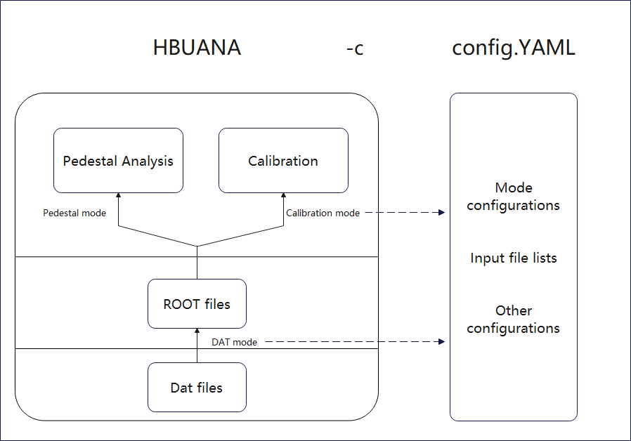

# README



## Collaborator

### Author: Zhen Wang (wangz1996@sjtu.edu.cn)

### Maintainer: Zhen Wang, Yukun Shi, Hongbin Diao

## Usage

### DAT mode (You want to turn .dat file to .root file):

Set DAT-ROOT "on-off" to "True";  
Give a dat file list at "file-list";  
Specify a output directory at "output-dir";

### Pedestal mode (You want to analyze pedestals):

Set Pedestal "on-off" to "True";  
Turn Cosmic/DAC "on-off" to "True" if you want to analyze with Cosmic/DAC files;  
Give a root file list at "file-list";  
Specify a name at "output-file";

### Calibration mode (You want to do calibration of high gain over low gain):

Set Calibration "on-off" to "True";  
Turn Cosmic/DAC "on-off" to "True" if you want to analyze with Cosmic/DAC files;  
Give a root file list at "file-list";  
Specify a pedestal file at "ped-file";

##Usage (Detailed)
To run the programme, just simply type this:

```
	hbuana -c config.yaml
```

If you don't have config.yaml in your current workspace, you can do the following to create one in the current directory.

```
	hbuana -x
```

#### Starting from now is the instruction on how one can compile the programme

## Prerequisite

### Environment

To compile the program, we are using the following environments which could be easily set up in lxslc7.ihep.cn:

```
	source /cvmfs/sft.cern.ch/lcg/views/LCG_97rc4python3/x86_64-centos7-gcc9-opt/setup.sh
```

### YAML

YAML is needed for this project.

To install yaml-cpp, you can follow the github repo:

```
	https://github.com/jbeder/yaml-cpp
```

You can install by typing the following line by line:

```
	git clone git@github.com:jbeder/yaml-cpp.git
	cd yaml-cpp
	mkdir build
	cd build
	cmake -DCMAKE_INSTALL_PREFIX=../install ../
	make -j4
	make install
	cd ../install
	export CMAKE_PREFIX_PATH=$CMAKE_PREFIX_PATH:$PWD
```

## Compile

To clone the project you need to:

```
	git clone git@github.com:wangz1996/hbuana.git
	cd hbuana
	mkdir build
	cd build
	cmake ../
	make -j4
	source setup.sh
```

Every time you want to use the hbuana, you need to source build/setup.sh to include hbuana into your PATH
